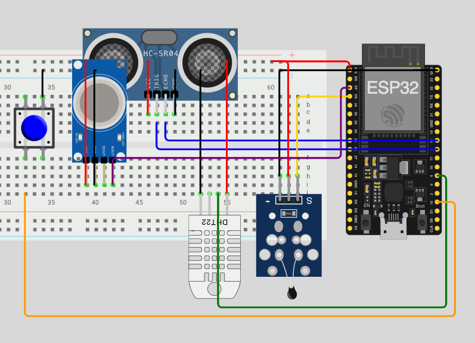

# FIAP - Faculdade de Informática e Administração Paulista

<p align="center">
  <a href="https://www.fiap.com.br/">
    
  </a>
</p>

## 👥 Grupo XX


## 👨‍🎓 Integrantes:

- Amanda Vieira Pires (RM565045)
- Ana Gabriela Soares Santos (RM565235)
- Bianca Nascimento de Santa Cruz Oliveira (RM561390)
- Milena Pereira dos Santos Silva (RM565464)
- Nayana Mehta Miazaki (RM565045)

## 👩‍🏫 Professores:

### Tutor(a)

- Lucas Gomes Moreira

### Coordenador(a)

- André Godoi
  

# Sistema Inteligente de Alerta de Enchentes para Recife

## 📖 Descrição do Projeto

Este sistema é uma solução digital desenvolvida no âmbito da Global Solution 2025.1 da FIAP, com o objetivo de prever e monitorar os riscos de enchentes na cidade do Recife, Pernambuco. Utilizando uma abordagem baseada em dados, o sistema simula um ambiente com sensores IoT, coleta e processa essas informações, e emprega um modelo de Machine Learning em conjunto com regras de negócio para classificar o nível de risco e emitir alertas.

Este projeto visa demonstrar como a tecnologia e a Inteligência Artificial podem ser aplicadas para mitigar os impactos de eventos naturais extremos, oferecendo uma ferramenta proativa para a Defesa Civil e para a população.

## 🎯 Contexto do Problema e Justificativa

Recife, conhecida por sua extensa rede hidrográfica e sua localização em uma planície costeira, possui um histórico de vulnerabilidade a inundações, especialmente durante os períodos de chuvas intensas. A Global Solution 2025.1 propôs o desafio de criar soluções para eventos naturais extremos, e o site `disasterscharter.org` foi consultado para contextualizar a gravidade e frequência de tais eventos globalmente, inspirando a escolha do tema "enchentes".

Para garantir a relevância e eficácia deste sistema para Recife, o mesmo foi calibrado com dados específicos da região:

* **Dados Pluviométricos Históricos:** Uma análise de séries históricas de precipitação diária em Recife (fontes governamentais/APAC) revelou uma forte sazonalidade, com picos de chuva concentrados entre abril e julho. Eventos extremos, como o observado em junho de 2024 com mais de 180 mm de chuva em um único dia em certas estações, demonstram a magnitude do desafio.
  
* **Parâmetros Hidrológicos Oficiais:** Os limiares de alerta do sistema são baseados nos dados técnicos da Agência Pernambucana de Águas e Clima (APAC) para o Rio Capibaribe (estação São Lourenço da Mata), conforme o *Relatório Progestão 2022*:
    * **Cota de Alerta:** 300 cm
    * **Cota de Inundação:** 400 cm
* **Padrões Meteorológicos:** A simulação considera as classificações de intensidade de chuva do Instituto Nacional de Meteorologia (INMET) e dados climatológicos de temperatura e umidade para Recife.

A combinação desses dados reais e parâmetros oficiais na calibração da simulação e na lógica do sistema assegura que o sistema opere com base na realidade hidrometeorológica de Recife.

## ⚙️ Arquitetura Geral do Sistema


O sistema é composto pelos seguintes módulos principais:

1.  **Módulo Sensor IoT (Simulador ESP32 no Wokwi):** Coleta de dados ambientais (nível da água, chuva, umidade do solo, temperatura, umidade do ar) em tempo real e simulação um evento de enchente em 5 fases progressivas.
2.  **Comunicação MQTT:** Os dados simulados são publicados em um tópico MQTT.
3.  **Receptor de Dados Python:** Um script Python (`receptor_mqtt.py`) assina o tópico MQTT, recebe os dados e os armazena em um banco de dados SQLite.
4.  **Banco de Dados SQLite (`projeto.db`):** Armazena o histórico de leituras dos sensores.
5.  **Módulo de Machine Learning (`modelo_ml.py`):** Carrega os dados do banco, treina um modelo de Árvore de Decisão para classificar o risco e oferece uma função de predição.
6.  **Módulo de Lógica de Negócio (`logica_negocio.py`):** Orquestra a análise, utilizando a predição do ML e aplicando regras de negócio críticas (como chuva acumulada em 24h e cotas de alerta/inundação) para determinar o status final do alerta.
7.  **Scripts de Apoio:** Inclui um script para inicializar o banco (`inicializar_banco.py`) e um para testar a análise completa (`testar_analise.py`).

## ✨ Principais Funcionalidades

* Coleta de dados sobre umidade do ar e do solo, tempetura, nível de água e intensidade de chuva
* Simulação realista de um evento de enchente em 5 fases progressivas.
* Armazenamento de dados de sensores e da simulação.
* Treinamento de um modelo de Machine Learning para classificação de risco (Normal, Alerta, Perigo).
* Aplicação de uma arquitetura híbrida: IA + Regras de Negócio para maior segurança.
* Cálculo de chuva acumulada nas últimas 24 horas para complementar a análise de risco.
* Emissão de status de alerta com mensagens claras e cores indicativas.

## 🛠️ Tecnologias Utilizadas

* **Módulo IoT:** Wokwi com ESP32 (linguagem C/C++)
* **Comunicação:** Protocolo MQTT (Broker público HiveMQ)
* **Backend & IA:** Python 3.x
    * `paho-mqtt`: Cliente MQTT
    * `sqlite3`: Banco de Dados
    * `pandas`: Manipulação de dados
    * `scikit-learn`: Machine Learning (DecisionTreeClassifier, train_test_split, accuracy_score)
    * `datetime`: Manipulação de datas e horas
* **Controle de Versão:** Git & GitHub

## 📂 Estrutura do Projeto no GitHub

```bash
gs1-phase4-flood-alert-system/
├── .gitignore
├── iot-sensor-module/                # Código da simulação ESP32 (Wokwi/PlatformIO)
│   ├── src/
│   │   └── main.cpp
│   ├── diagram.json                  # Circuito simulado no Wokwi
│   ├── platformio.ini                # Configuração do PlatformIO
│   ├── wokwi.toml                    # Caminho para firmware na simulação
│
├── python-backend/                   # Scripts Python do backend e IA
│   ├── inicializar_banco.py
│   ├── receptor_mqtt.py
│   ├── modelo_ml.py
│   ├── logica_negocio.py
│   ├── testar_analise.py
│   ├── app.py                        # Visualização de dashboard
│   └── projeto.db                    # Banco de dados SQLite
|
├── img/                              # Imagens utilizadas no README
│   ├── logo_fiap.png                 # Logo da faculdade
|
└── README.md                     
```

## 🔧 Componentes Detalhados do Sistema

### Módulo Sensor IoT (Simulação ESP32 no Wokwi)

O arquivo `iot-sensor-module/src/main.cpp` contém o código para o ESP32 responsável por simular e/ou coletar dados reais de sensores ambientais relevantes para enchentes.

**Principais Características:**

- **Modo Duplo:** O sistema pode operar tanto em modo simulação (evento de enchente em 5 fases) quanto em modo real (leitura dos sensores físicos), alternando entre eles por meio de um botão físico conectado ao ESP32.
- **Sensores Utilizados:**
  - **Ultrassônico:** Mede o nível da água (em cm).
  - **MQ2 (simulado):** Mede a intensidade da chuva (mm/h).
  - **NTC (simulado):** Mede a umidade do solo (%).
  - **DHT22:** Mede temperatura do ar (°C) e umidade relativa do ar (%).
- **Envio dos Dados:** Os dados são enviados a cada 2 segundos para o broker MQTT público (`broker.hivemq.com`) no tópico `fiap/gs/inundacao`, no formato JSON.

**Funcionamento da Simulação de 5 Fases:**

Cada fase dura aproximadamente 45 segundos, simulando a evolução de um evento de enchente realista calibrado para Recife:

1. **FASE_1_NORMAL:**  
   - Chuva leve ou ausente (0–10 mm/h), nível do rio seguro (~180 cm), solo em condição normal (~65%).
2. **FASE_2_AUMENTO:**  
   - Início de tempestade violenta (chuva 50–75 mm/h), nível do rio sobe rapidamente até a cota de alerta (300 cm), solo ficando mais úmido.
3. **FASE_3_ALERTA:**  
   - Chuva forte contínua (25–50 mm/h) sobre solo já saturado, nível do rio ultrapassa a cota de alerta (300 cm) e se aproxima da cota de inundação (420 cm), umidade do solo próxima do máximo.
4. **FASE_4_CRITICO:**  
   - Chuva diminui (5–25 mm/h), mas o nível do rio atinge o pico máximo (até 450 cm) devido ao acúmulo de água, solo saturado.
5. **FASE_5_RECEDENDO:**  
   - Chuva cessa ou é muito fraca (0–5 mm/h), nível do rio e umidade do solo diminuem gradualmente, retornando aos valores normais.

**Modo Real:**

- Quando o modo simulação está desativado, o ESP32 lê os valores dos sensores físicos conectados e envia os dados reais para o backend, permitindo testes com hardware real.

**Calibração e Realismo:**

- Os valores simulados para cada sensor foram definidos com base em dados históricos e parâmetros oficiais para Recife, garantindo realismo e relevância para o contexto local.
- O ciclo completo da simulação permite observar a evolução de um evento extremo, desde a normalidade até o pico de inundação e o retorno à estabilidade.

**Resumo Técnico e Diagrama:**

- O ESP32 conecta-se automaticamente ao Wi-Fi e ao broker MQTT.
- Alternância entre modo simulação e modo real via botão físico (com debounce).
- Dados enviados em formato JSON, incluindo: `water_level_cm`, `rain_mm_hour`, `soil_humidity_pct`, `temp_c`, `humidity_air_pct`.
- Ao final da FASE_5_RECEDENDO, o ciclo é reiniciado automaticamente.



> Este módulo é fundamental para fornecer dados realistas e variados ao backend Python, permitindo o treinamento e validação do modelo de Machine Learning e das regras de negócio do sistema de alerta.
### Pipeline de Dados

1.  **MQTT:** O ESP32 (Wokwi) envia os dados dos sensores como um payload JSON para o broker público `broker.hivemq.com` no tópico `fiap/gs/inundacao`.
2.  **Receptor Python (`receptor_mqtt.py`):** Este script se inscreve no tópico MQTT, recebe as mensagens JSON, extrai os dados dos sensores e os insere na tabela `sensores` do banco de dados `projeto.db`, adicionando um timestamp do momento da inserção.
3.  **Banco de Dados (`projeto.db`):** Um arquivo SQLite que armazena o histórico de leituras dos sensores, servindo como fonte de dados para o treinamento do modelo de ML e para testes. O script `inicializar_banco.py` cria a tabela se ela não existir.

### Modelo de Machine Learning (`modelo_ml.py`)

* **Escolha do Modelo (Árvore de Decisão):** Foi escolhido um `DecisionTreeClassifier` da biblioteca `scikit-learn`. Esta escolha se justifica por:
    * Ser um modelo eficaz para problemas de classificação.
    * Ser relativamente fácil de entender e interpretar (suas regras de decisão podem ser visualizadas).
    * Ter um bom desempenho computacional para este volume de dados.
* **Fonte dos Dados de Treinamento:** O modelo é treinado com os dados coletados pela simulação no Wokwi e armazenados no `projeto.db`. A função `definir_risco_real` neste script é crucial, pois ela rotula cada registro de acordo com os parâmetros calibrados de Recife (nível do rio, intensidade da chuva, umidade do solo), criando o "gabarito" para o aprendizado da IA.
* **Arquitetura Híbrida (ML + Regras de Negócio):** Embora o modelo de ML seja treinado para prever o risco, a decisão final no `logica_negocio.py` considera essa predição, mas também aplica regras de negócio críticas e inegociáveis (como os níveis absolutos de inundação do rio ou chuva acumulada). Isso garante um sistema mais seguro e confiável, onde o ML atua como um analista inteligente e as regras de negócio como um protocolo de emergência.
* **Treinamento "Lazy Loading":** O modelo é treinado apenas uma vez, na primeira vez que uma predição é solicitada (através da função `prever_risco`). Isso é eficiente, pois evita retreinamentos desnecessários a cada nova leitura de sensor, especialmente em um contexto de protótipo ou demonstração. Para um sistema em produção, um retreinamento periódico com novos dados seria implementado.

### Lógica de Negócio e Sistema de Alerta (`logica_negocio.py`)

Este módulo consolida as informações para gerar o alerta final.
1.  Recebe os dados atuais do sensor.
2.  Chama a função `prever_risco` do `modelo_ml.py` para obter uma predição inicial da IA.
3.  Calcula a `chuva_acumulada_24h` consultando o histórico no banco de dados.
4.  Aplica as regras de override:
    * Se `chuva_acumulada_24h >= 100mm`, o status é `Perigo`.
    * Se `nivel_agua >= 400cm`, o status é `Perigo`.
    * Se `nivel_agua >= 300cm`, o status é (no mínimo) `Alerta`.
5.  Determina o `status_final` e retorna um dicionário com o status, cor e mensagem.

## ▶️ Como Rodar o Projeto

### ⚠️ Importante: Estratégia de Uso dos Modos (Simulação vs. Real)

O Módulo Sensor IoT opera em dois modos distintos, e é crucial entender o propósito de cada um para o treinamento e teste do sistema de IA:

* **Modo Simulação (Para Treinamento de Qualidade):**
    Este modo gera o cenário completo e calibrado de uma enchente em 5 fases. **É o modo que deve ser utilizado para gerar o `projeto.db` destinado ao treinamento inicial do modelo**, pois garante um conjunto de dados rico, com exemplos de todas as categorias de risco (Normal, Alerta, Perigo).

* **Modo Real (Para Teste e Validação em Tempo Real):**
    Este modo lê os valores dos controles manuais no Wokwi. **É ideal para testar a resposta do sistema *já treinado* a dados arbitrários e validar o fluxo de ponta a ponta.** Não é recomendado usar dados gerados neste modo para o treinamento inicial, pois eles podem não conter a diversidade e a progressão necessárias.

> **Recomendação:** Para replicar os resultados e garantir a maior acurácia do modelo, sempre gere seu conjunto de dados de treinamento utilizando o **Modo Simulação**.

---

### ✅ Requisitos

- [Visual Studio Code (VS Code)](https://code.visualstudio.com/)
- Extensões instaladas no VS Code:
  - **PlatformIO IDE** (ícone da formiguinha 🐜)
  - **Wokwi for VS Code** (ícone com `<>` da simulação)
  - **SQL Viewer**
- Git instalado na máquina (para clonar o repositório)
- As seguintes bibliotecas instaladas:
  ```bash
  pip install streamlit pandas matplotlib seaborn paho-mqtt
  ```

## 🔧 Passo a Passo

### Parte 1 – Simulação do Hardware (ESP32 no Wokwi)

1. **Clone o repositório**

   - Abra o terminal
   - Execute o comando:

     ```bash
     git clone https://github.com/fiap-ia-2025/gs1-phase4-flood-alert-system.git
     ```

<br>

2. **Abra o VS Code e carregue apenas a pasta iot-sensor-module como uma janela separada.**

- Não abra a pasta raiz do repositório. Clique em "Abrir Pasta" no VS Code e selecione diretamente `iot-sensor-module`.

<br>

3. **Compile o projeto com PlatformIO**

- No VS Code, clique no ícone da formiguinha 🐜 (PlatformIO) no menu lateral esquerdo
- Clique em **"Build"** para compilar o `main.cpp` (aguarde a conclusão)

<br>

4. **Execute a simulação com Wokwi**

- Pressione `Ctrl+Shift+P` (ou `Cmd+Shift+P` no Mac) para abrir a Command Palette
- Digite `>Wokwi: Start Simulation` e pressione Enter
- A simulação será aberta no navegador com o firmware já compilado


**OBS: O código em `iot-sensor-module/` pode ser aberto com o PlatformIO no VS Code (passo a passo acima) ou carregado diretamente no simulador Wokwi.**

### Parte 2 – Como Executar a integração com Python
- Abra outra janela do VS Code e carregue apenas a pasta `python-backend`
  
- Existem duas formas de testar o sistema:

**Opção 1: Utilizando o Banco de Dados Existente (Recomendado para Avaliação Rápida)**

O repositório já inclui um arquivo `python-backend/projeto.db` populado com dados de uma simulação de 2 ciclos completos (aproximadamente 7 minutos e 30 segundos de simulação, gerando mais de 200 registros).

1.  Navegue até a pasta `python-backend`:
    ```bash
    cd python-backend
    ```
2.  Execute o script de teste da análise:
    ```bash
    python testar_analise.py
    ```
    Isso carregará os dados do `projeto.db` existente, treinará o modelo de ML (se for a primeira vez) e processará todos os registros, mostrando a evolução do status do alerta.

**Opção 2: Começando do Zero (Gerando Novos Dados)**

Se desejar gerar um novo conjunto de dados ou testar o pipeline completo:

1.  **(Opcional) Apague o banco de dados existente:**
    Delete o arquivo `python-backend/projeto.db` se quiser começar com um banco totalmente limpo.
2.  **Inicialize o Banco (se apagou ou se é a primeira vez):**
    Navegue até a pasta `python-backend` e execute:
    ```bash
    python inicializar_banco.py
    ```
3.  **Inicie a Simulação no Wokwi:**
    Abra o projeto `iot-sensor-module` no Wokwi (ou compile e rode via PlatformIO se estiver configurado para simulação) e inicie a simulação. O ESP32 começará a enviar dados para o broker MQTT.
4.  **Execute o Receptor MQTT:**
    Em um novo terminal, navegue até a pasta `python-backend` e execute:
    ```bash
    python receptor_mqtt.py
    ```
    Deixe este script rodando para coletar os dados da simulação (recomenda-se pelo menos 2 ciclos completos da simulação no Wokwi, cerca de 7 minutos e 30 segundos).
5.  **Pare o Receptor MQTT** (`Ctrl+C`) após coletar dados suficientes.
6.  **Execute o Teste da Análise:**
    Ainda na pasta `python-backend`, execute:
    ```bash
    python testar_analise.py
    ```
7.  **Dashboard Streamlit:**
   Ainda na pasta `python-backend`, para verificar o dashboard com as informações da previsão de risco, execute:
    ```bash
    streamlit run app.py
    ```

## 📊 Resultados Esperados e Demonstração

O sistema deverá:
* Coletar e armazenar os dados da simulação corretamente.
* Treinar o modelo de Machine Learning com uma acurácia satisfatória (ex: >90%) nos dados de teste.
* O script `testar_analise.py` demonstrará a progressão do status de alerta (Normal -> Perigo) conforme os dados simulados evoluem, mostrando a capacidade do sistema de identificar riscos baseados nos parâmetros de Recife.
* (incluir aqui informação do streamit tbm)

*(incluir vídeo para o youtube aqui).*


## 📚 Fontes de Pesquisa e Dados de Referência

A calibração e contextualização deste projeto foram baseadas em dados e informações de fontes oficiais e públicas, assegurando que a simulação e a lógica de decisão do sistema reflitam as condições reais de Recife:

* **Dados Climatológicos (Temperatura e Umidade do Ar):**
    * As faixas de temperatura e umidade do ar utilizadas na simulação foram baseadas nas médias climatológicas históricas para Recife durante o período chuvoso.
    * Fonte Principal: Instituto Nacional de Meteorologia (INMET), com dados compilados e acessíveis, por exemplo, na:
        * [Tabela Climática de Recife – Wikipédia](https://pt.wikipedia.org/wiki/Predefini%C3%A7%C3%A3o:Tabela_clim%C3%A1tica_de_Recife)

* **Parâmetros Hidrológicos do Rio Capibaribe (Cotas de Alerta e Inundação):**
    * Os limiares de 300 cm (Alerta) e 400 cm (Inundação) para o Rio Capibaribe são os valores oficiais para a estação de monitoramento de São Lourenço da Mata, que influencia diretamente o Recife.
    * Fonte: Agência Pernambucana de Águas e Clima (APAC) e Agência Nacional de Águas e Saneamento Básico (ANA).
    * Documento de Referência: *Relatório de Atividades e Cumprimento de Metas – Progestão Ciclo 2022 (PE)*.
    * Link Direto: [APAC/ANA - Relatório Progestão PE 2022 (PDF, ver Tabela 5, pág. 10)](https://progestao.ana.gov.br/progestao-1/certificacao/certificacoes-2013-a-2018/certificacao-2022/certificacao-das-metas-federativas-2022/relatorios-progestao-2022/pe_relatorio_progestao_apac_2022.pdf)

* **Dados Pluviométricos Históricos de Recife (Diários/Mensais):**
    * A análise de eventos de chuva extremos, bem como a calibração da intensidade e da dinâmica da precipitação na simulação do sistema, foram baseadas em dados históricos diários reais de estações pluviométricas em Recife.
    * Fonte: Agência Pernambucana de Águas e Clima (APAC) - Plataforma de Coleta de Dados.
    * Link de Acesso ao Monitoramento: [APAC - Monitoramento Pluviométrico](http://www.apac.pe.gov.br/meteorologia/monitoramento-pluviometrico.php](http://old.apac.pe.gov.br/meteorologia/monitoramento-pluvio.php)
    * Período Específico Analisado para Calibração Detalhada da Simulação: Para a construção do "roteiro" do evento extremo simulado no Wokwi (incluindo a progressão da chuva ao longo das 5 fases), foram analisados em detalhe os dados diários do período de **1º de maio de 2024 a 31 de julho de 2024**.
    * Justificativa da Escolha do Período (01/05/2024 - 31/07/2024): Este intervalo foi selecionado por:
        * Abranger o núcleo da estação chuvosa de Recife, historicamente associada aos maiores volumes pluviométricos e riscos de inundação.
        * Permitir a observação e análise de eventos de precipitação completos, incluindo seus picos, durações e sequências de dias chuvosos.
        * Representar o ciclo chuvoso completo mais recente, fornecendo dados relevantes para os padrões climáticos atuais.
    * *Desta análise detalhada, o evento específico ocorrido em meados de junho de 2024 (com picos diários superiores a 180mm em algumas estações) foi utilizado como principal inspiração para modelar as fases e a intensidade da chuva na simulação do Wokwi.*

* **Padrões de Intensidade de Chuva (mm/h):**
    * Os limiares numéricos para definir a intensidade da chuva instantânea no sistema (ex: >25 mm/h para chuvas fortes, >50 mm/h para eventos extremos) são baseados nos padrões de classificação do Instituto Nacional de Meteorologia (INMET).
    * Referências (citando INMET):
        * [Cosch - O que é índice pluviométrico?](https://cosch.com.br/o-que-e-indice-pluviometrico/)
        * [Portal Multiplix - Meteorologista do INMET explica como classificar a intensidade das chuvas](https://www.portalmultiplix.com/noticias/cotidiano/meteorologista-do-inmet-explica-como-classificar-a-intensidade-das-chuvas)
